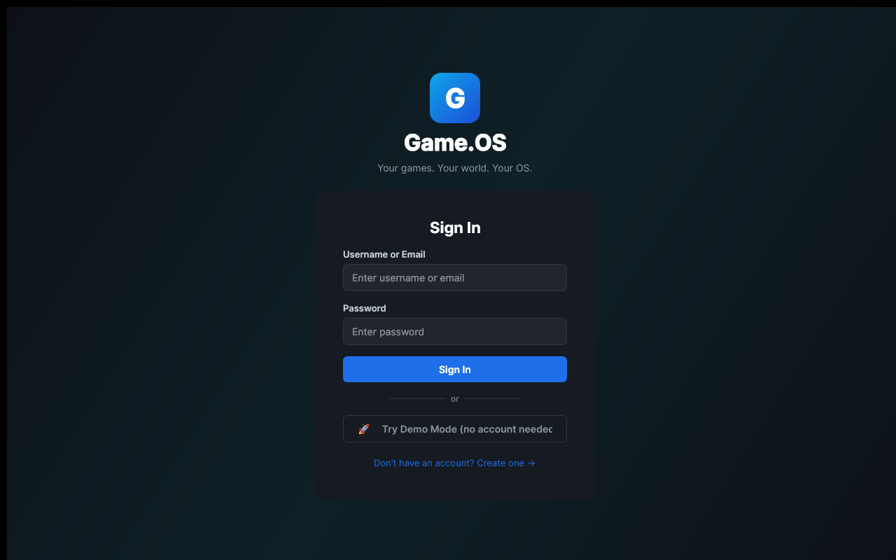
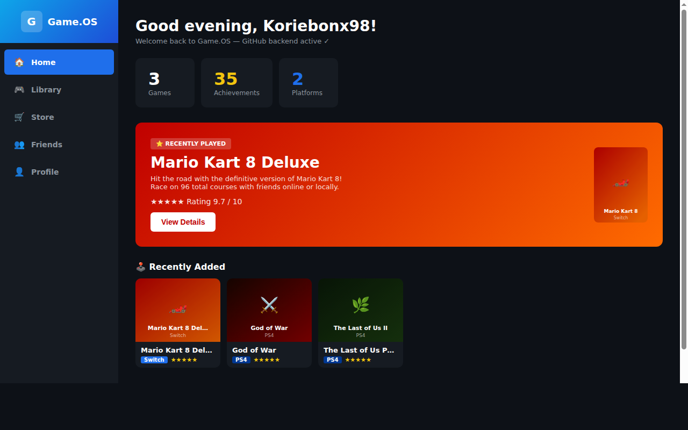
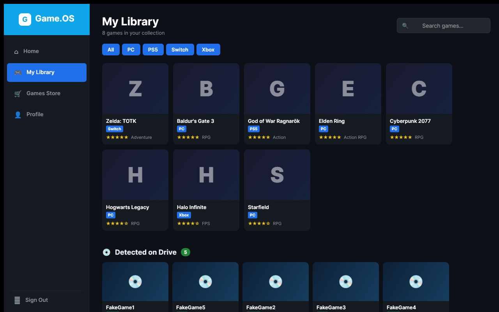
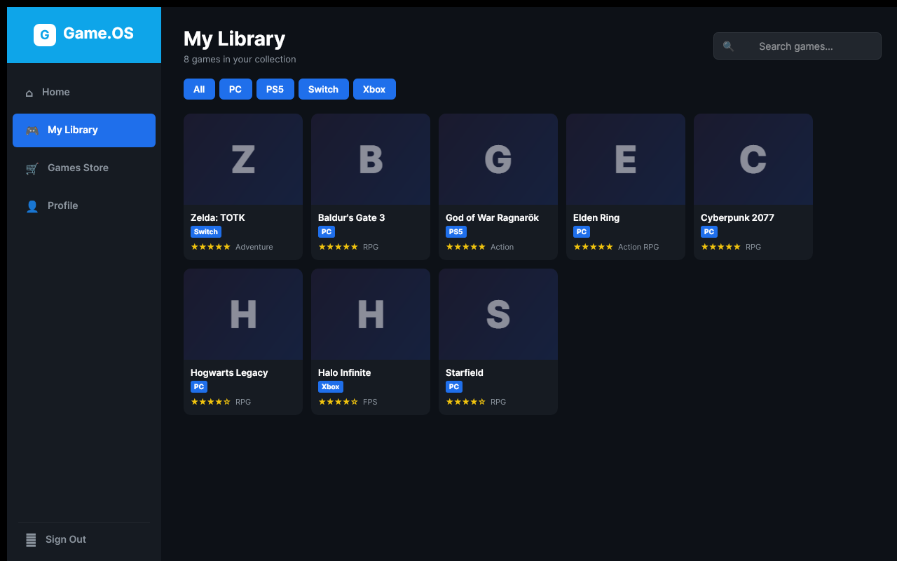
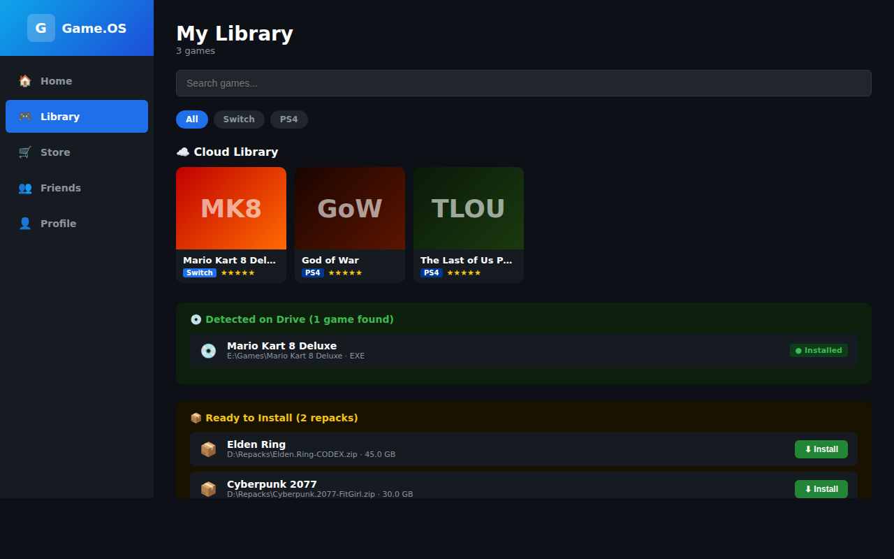
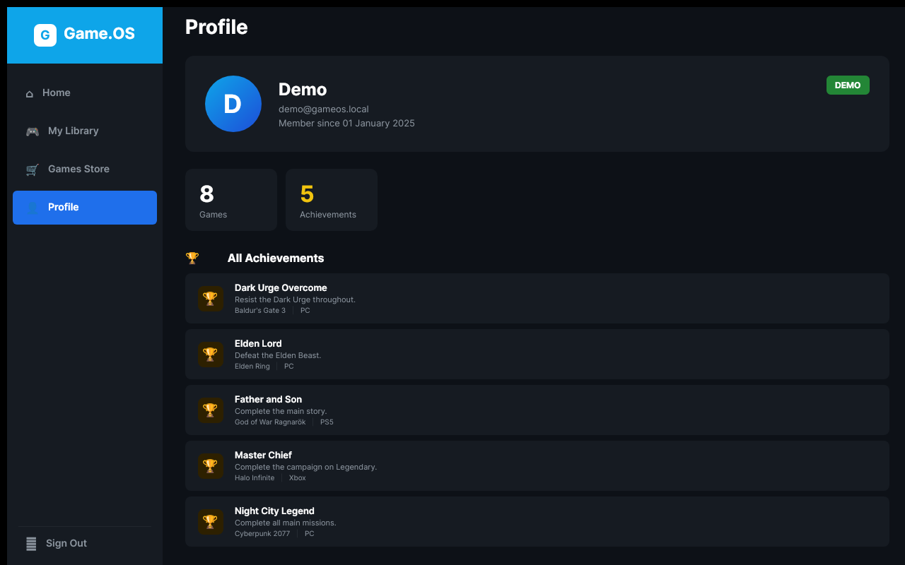

# Game.OS Launcher — Graphical PC App

A **graphical Windows/Linux/macOS PC game launcher** for Game.OS — designed like  
**Xbox Dashboard / PlayStation 5 / Steam Big Picture / Playnite**.

Built with **.NET 8** + [Avalonia UI](https://avaloniaui.net/) (cross-platform WPF-style GUI).

---

## Screenshots

| Login | Dashboard |
|---|---|
|  |  |

| My Library | Games Store |
|---|---|
|  |  |

| Local Game Detection | Profile |
|---|---|
|  |  |

---

## Features

| Screen | What it does |
|---|---|
| 🔐 **Login / Register** | Dark-themed sign-in form; create a new account via the same backend API |
| 🏠 **Dashboard / Home** | Stats tiles, featured game hero banner, game card grid, recent achievements |
| 🎮 **My Library** | Game cover cards, platform filter chips, search, star ratings |
| 🛒 **Games Store** | Featured titles carousel, browse all, genre filter, search, add to library |
| 👤 **Profile** | Avatar, stats, all achievements list, LIVE / ADMIN badge |
| 🛡️ **Admin Mode** | When logged in as `Admin.GameOS`, a catalog management panel appears in the store |

---

## Quick Start

### Prerequisites
- [.NET 8 SDK](https://dotnet.microsoft.com/download) or later
- The **Game.OS backend** running (see below)

### Configuration

The launcher reads one environment variable:

| Variable | Default | Purpose |
|---|---|---|
| `GAMEOS_API_BASEURL` | `http://localhost:3000` | Base URL of the Game.OS backend API |

### Run the launcher

```bash
# Start the backend first (from the backend/ directory)
cd backend
npm install
node index.js

# In another terminal, run the launcher
cd GameLauncher
dotnet run -c Release
```

With a custom backend URL:
```bash
export GAMEOS_API_BASEURL="https://your-backend.example.com"
cd GameLauncher
dotnet run -c Release
```

---

## Admin Login

Log in with the admin account (`Admin.GameOS`) to unlock admin features:

- The **Games Store** page shows an **Admin — Catalog Management** panel
- Admin can **Add** new games to the in-store catalog
- Admin can **Remove** games from the catalog
- Note: admin catalog changes are **session-only** (no dedicated backend endpoint for catalog persistence yet)

The admin account is defined server-side in the backend.  Contact your backend operator for the admin password.

---

## Backend Setup

The launcher connects to the Game.OS Node.js/Express backend.  See `../backend/README.md` for full setup instructions.  Required environment variables for the backend:

```
GITHUB_TOKEN       = GitHub personal access token (repo scope) for the data repository
REPO_OWNER         = GitHub owner of the data repository
REPO_NAME          = Name of the private data repository
TOKEN_HMAC_SECRET  = Secret key for signing API tokens
```

Once the backend is running on `http://localhost:3000` the launcher will connect automatically.

---

## Build a standalone EXE

```bash
# Windows x64 — produces a single .exe file
dotnet publish -c Release -r win-x64 --self-contained true -p:PublishSingleFile=true

# macOS (Apple Silicon)
dotnet publish -c Release -r osx-arm64 --self-contained true -p:PublishSingleFile=true

# Linux x64
dotnet publish -c Release -r linux-x64 --self-contained true -p:PublishSingleFile=true
```

The published executable appears in `bin/Release/net8.0/<rid>/publish/`.

---

## Visual Studio

Open `Game.OS.Userdata.sln` in the repository root to load both the launcher and the scanner tests in Visual Studio 2022+.

---

## Project Structure

```
GameLauncher/
├── Program.cs                  # Entry point (Avalonia bootstrap)
├── App.axaml / App.axaml.cs    # Application-level styles + startup
├── GameOsClient.cs             # Game.OS backend HTTP API client
├── DemoData.cs                 # Static store catalog + game metadata for enrichment
├── Models/Models.cs            # UserProfile, Game, Achievement, FriendEntry, …
├── Styles/
│   └── GameOsStyles.axaml      # Dark Xbox/PS5/Steam theme (colours, cards, buttons)
├── ViewModels/
│   ├── MainViewModel.cs        # Navigation state + session (MVVM root)
│   ├── LoginViewModel.cs       # Sign-in / register logic
│   ├── DashboardViewModel.cs   # Stats, recent games, featured hero
│   ├── LibraryViewModel.cs     # Filter, search, game collection
│   ├── StoreViewModel.cs       # Browse, search, genre filter, add to library, admin panel
│   ├── FriendsViewModel.cs     # Friends list loaded from API with presence status
│   └── ProfileViewModel.cs     # Avatar, stats, achievements
└── Views/
    ├── MainWindow.axaml        # Window shell with left-sidebar navigation
    ├── LoginView.axaml         # Graphical login/register screen
    ├── DashboardView.axaml     # Xbox-style home with hero banner + game tiles
    ├── LibraryView.axaml       # Game cover card grid
    ├── StoreView.axaml         # Store with featured carousel + catalogue + admin panel
    └── ProfileView.axaml       # Profile card + achievements list
```

---

## Design

- **Background**: `#0d1117` (GitHub dark / Xbox One dark)  
- **Accent**: `#1f6feb` (GitHub blue / Xbox-style blue)  
- **Success**: `#238636` (green — PS5 / Xbox add-to-library)  
- **Cards**: Rounded 10-12px, dark `#161b22` with hover lift  
- **Typography**: Inter / Segoe UI — bold headings, muted metadata
